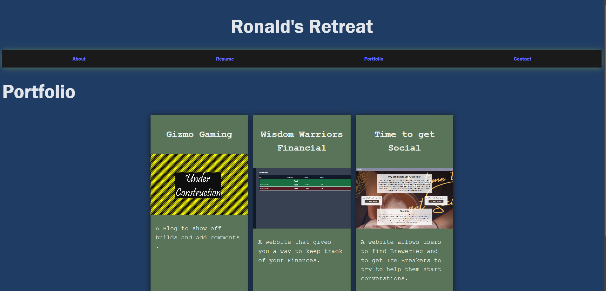

# Portfolio

Welcome to my portfolio repository! This repository contains the source code for my personal portfolio website.

## About

This portfolio showcases my projects, skills, and experience. It serves as a central hub where visitors can learn more about me, my work, and how to get in touch.

## Features

* Project Showcase: Highlighting my latest projects with descriptions and links.
* Skills: Displaying my skills and areas of expertise.
* Resume: Providing access to my resume for further details about my experience and qualifications. 
* Contact: Offering various ways to contact me, including email and social media links.

Technologies Used
* Frontend: HTML, CSS, JavaScript, React.js
* Styling: scss
* Deployment: Netlify

## Deployment

[Link to Live App](https://remarkable-kheer-2e0781.netlify.app/)
 